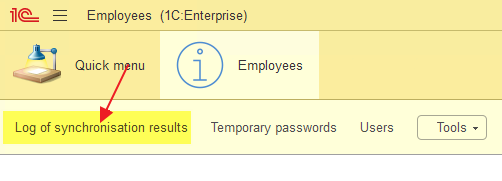

# Deploying

1. Open an empty database 1C in **Designer**

2. Next, select **Configuration** and select **Restore Configuration in Files**

3. Next, select the directory **src** from this project and click button **Import**

4. Next, click **Update database configuration (F7)**

5. Next, click **Accept**

# Settings

## Creating an Administrator

1. In **Designer** select **Administration** and select **Users**

2. Next, click button **Add (Ins)** and create a user

3. For the new user, specify the **FullAccess** role and click **OK**

## Setting up Synchronization

1. In subsystem Employees, click **Settings**

2. Specify the correct settings for connecting to the REST API endpoint /api/employees

3. To sync, click **Sync**

4. To use sync as scheduled task, set up a **Schedule**

# Other

Information about sync errors is saved in the **Event log**.
Information about successful synchronization is saved in the **Log of synchronisation results**

